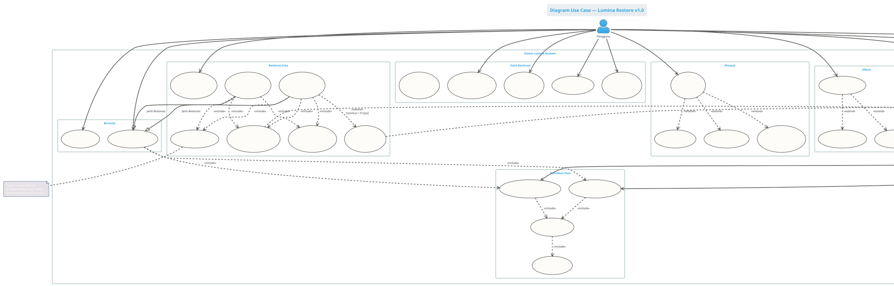

# 📊 Use Case Diagram — Lumina Restore

> Kode PlantUML di bawah ini dapat di-render di [plantuml.com/plantuml](https://www.plantuml.com/plantuml/uml/) atau plugin PlantUML di IDE.

```plantuml
@startuml UseCase_LuminaRestore
!theme cerulean
skinparam actorStyle awesome
skinparam packageStyle rectangle
skinparam usecaseBackgroundColor #FDFCF8
skinparam usecaseBorderColor #5e5f5c
skinparam packageBorderColor #98B9B7
skinparam arrowColor #5e5f5c
skinparam actorBorderColor #456462
skinparam noteBackgroundColor #E5E1E6

title Diagram Use Case — Lumina Restore v1.0

actor "Pengguna" as User

rectangle "Sistem Lumina Restore" {

  ' === Modul Beranda ===
  package "Beranda" {
    usecase "UC-01\nMelihat Beranda" as UC01
    usecase "UC-02\nMemilih Jenis Restorasi" as UC02
  }

  ' === Modul Upload ===
  package "Pemilihan Foto" {
    usecase "UC-03\nMemilih Foto dari Galeri" as UC03
    usecase "UC-04\nMengambil Foto dari Kamera" as UC04
    usecase "UC-05\nMempratinjau Foto" as UC05
    usecase "UC-06\nMemvalidasi Foto" as UC06
  }

  ' === Modul Restorasi ===
  package "Restorasi Foto" {
    usecase "UC-07\nMelakukan Restorasi\nLow-Light" as UC07
    usecase "UC-08\nMelakukan Restorasi\nDeblurring" as UC08
    usecase "UC-09\nMenampilkan Progres\nInferensi" as UC09
    usecase "UC-10\nMembatalkan Proses\nRestorasi" as UC10
    usecase "UC-11\nMemeriksa Ketersediaan\nMemori" as UC11
    usecase "UC-12\nMenjalankan Tiled\nInference" as UC12
    usecase "UC-13\nMemuat Model ONNX" as UC13
  }

  ' === Modul Hasil ===
  package "Hasil Restorasi" {
    usecase "UC-14\nMelihat Perbandingan\nSebelum/Sesudah" as UC14
    usecase "UC-15\nMenyimpan Hasil\nke Galeri" as UC15
    usecase "UC-16\nMembagikan Hasil" as UC16
    usecase "UC-17\nMenyimpan Hasil\nke Album" as UC17
    usecase "UC-18\nMelihat Metadata\nRestorasi" as UC18
  }

  ' === Modul Riwayat ===
  package "Riwayat" {
    usecase "UC-19\nMelihat Daftar\nRiwayat" as UC19
    usecase "UC-20\nMemfilter Riwayat" as UC20
    usecase "UC-21\nMenghapus Riwayat" as UC21
    usecase "UC-22\nMembuka Ulang Hasil\ndari Riwayat" as UC22
  }

  ' === Modul Album ===
  package "Album" {
    usecase "UC-23\nMembuat Album Baru" as UC23
    usecase "UC-24\nMelihat Daftar Album" as UC24
    usecase "UC-25\nMengelola Album" as UC25
  }

  ' === Modul Pengaturan ===
  package "Pengaturan" {
    usecase "UC-26\nMelihat Informasi\nPenyimpanan" as UC26
    usecase "UC-27\nMenghapus Cache" as UC27
    usecase "UC-28\nMelihat Informasi\nModel" as UC28
  }
}

' === Relasi Pengguna ===
User --> UC01
User --> UC02
User --> UC03
User --> UC04
User --> UC14
User --> UC15
User --> UC16
User --> UC17
User --> UC19
User --> UC24
User --> UC26
User --> UC10

' === Relasi Include ===
UC02 ..> UC03 : <<include>>
UC02 ..> UC04 : <<include>>
UC03 ..> UC05 : <<include>>
UC04 ..> UC05 : <<include>>
UC05 ..> UC06 : <<include>>

UC07 ..> UC13 : <<include>>
UC07 ..> UC11 : <<include>>
UC07 ..> UC09 : <<include>>
UC08 ..> UC13 : <<include>>
UC08 ..> UC11 : <<include>>
UC08 ..> UC09 : <<include>>

' === Relasi Extend ===
UC08 ..> UC12 : <<extend>>\n[resolusi > 512px]
UC19 ..> UC20 : <<extend>>
UC19 ..> UC21 : <<extend>>
UC19 ..> UC22 : <<extend>>
UC24 ..> UC23 : <<extend>>
UC24 ..> UC25 : <<extend>>
UC26 ..> UC27 : <<extend>>
UC26 ..> UC28 : <<extend>>

' === Generalisasi ===
UC07 --|> UC02 : Jenis Restorasi
UC08 --|> UC02 : Jenis Restorasi

' === Catatan ===
note right of UC12
  Tiled Inference aktif jika:
  - Resolusi gambar > 512×512 px
  - Model yang digunakan NAFNet
  - RAM tersedia < ambang batas
end note

note right of UC11
  Pengecekan RAM wajib dilakukan
  sebelum setiap sesi inferensi
  untuk mencegah OOM crash
end note

note bottom of UC13
  Hanya 1 model dimuat
  di memori dalam satu waktu.
  Model sebelumnya di-unload.
end note

@enduml
```
