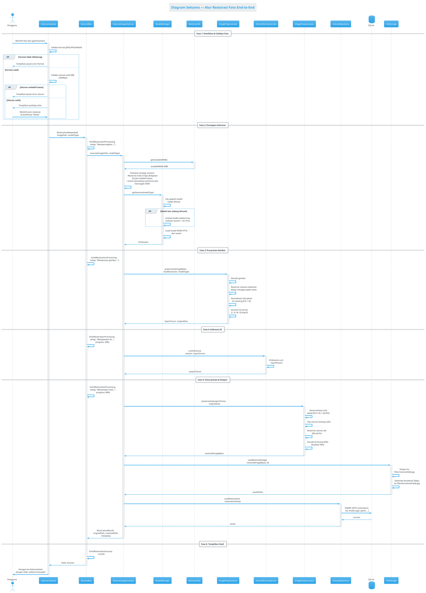
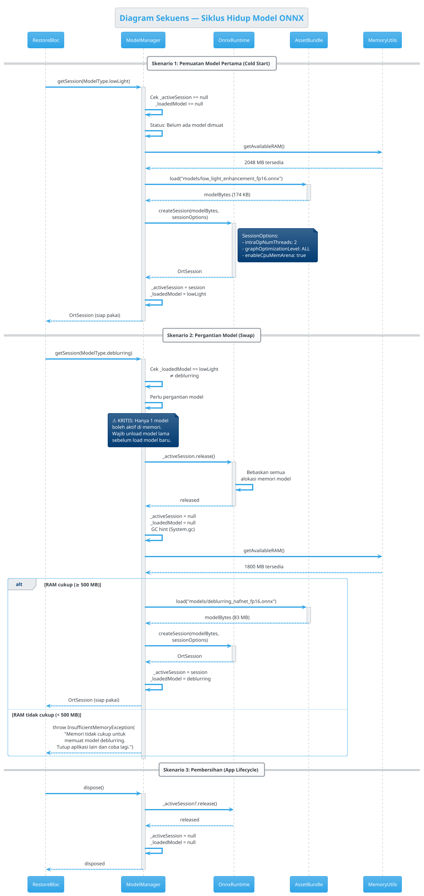

# 🔄 Sequence Diagrams — Lumina Restore

> Kode PlantUML di bawah ini dapat di-render di [plantuml.com](https://www.plantuml.com/plantuml/uml/).  
> Terdapat 3 diagram untuk proses-proses kompleks dalam sistem.

---

## 1. Alur Restorasi Foto End-to-End

Menggambarkan alur lengkap dari pemilihan foto hingga penyimpanan hasil, termasuk penanganan kesalahan.

---

## 3. Siklus Hidup Model ONNX (Model Lifecycle)

Menggambarkan manajemen pemuatan dan pembongkaran model untuk memastikan hanya satu model aktif di memori.

