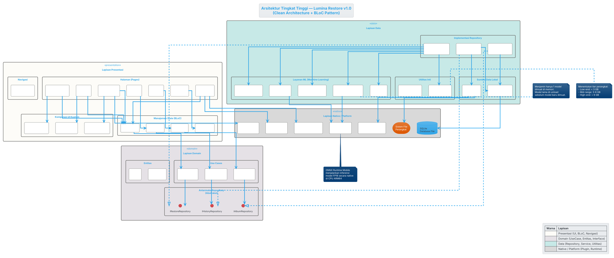

# 🏛️ High-Level Architecture — Lumina Restore

> Kode PlantUML di bawah dapat di-render di [plantuml.com](https://www.plantuml.com/plantuml/uml/).

```plantuml
@startuml Arch_HighLevel
!theme cerulean
skinparam componentStyle rectangle
skinparam packageStyle rectangle
skinparam defaultFontName Inter
skinparam shadowing false
skinparam linetype ortho

skinparam package {
    BackgroundColor<<presentation>> #FDFCF8
    BackgroundColor<<domain>> #E5E1E6
    BackgroundColor<<data>> #C7E9E7
    BackgroundColor<<native>> #D9D9D9
    BorderColor #5e5f5c
}

skinparam component {
    BackgroundColor White
    BorderColor #757873
}

title Arsitektur Tingkat Tinggi — Lumina Restore v1.0\n(Clean Architecture + BLoC Pattern)

' ===== LAPISAN PRESENTASI =====
package "Lapisan Presentasi" <<presentation>> {

    package "Halaman (Pages)" {
        component [Halaman\nBeranda] as PageHome
        component [Halaman\nUpload Foto] as PageUpload
        component [Halaman\nProses Restorasi] as PageProcess
        component [Halaman\nHasil Restorasi] as PageResult
        component [Halaman\nRiwayat] as PageHistory
        component [Halaman\nAlbum] as PageAlbum
        component [Halaman\nPengaturan] as PageSettings
    }

    package "Komponen UI Kustom" {
        component [Slider\nSebelum/Sesudah] as WidgetSlider
        component [Indikator\nProgres Inferensi] as WidgetProgress
        component [Kartu\nJenis Restorasi] as WidgetCard
    }

    package "Manajemen State (BLoC)" {
        component [RestoreBloc] as BlocRestore
        component [HistoryBloc] as BlocHistory
        component [AlbumBloc] as BlocAlbum
        component [SettingsBloc] as BlocSettings
    }

    package "Navigasi" {
        component [GoRouter\nKonfigurasi Rute] as Router
    }
}

' ===== LAPISAN DOMAIN =====
package "Lapisan Domain" <<domain>> {

    package "Use Cases" {
        component [RestoreImage\nUseCase] as UCRestore
        component [ManageHistory\nUseCase] as UCHistory
        component [ManageAlbum\nUseCase] as UCAlbum
    }

    package "Entitas" {
        component [Restoration\nEntity] as EntityRestore
        component [Album\nEntity] as EntityAlbum
    }

    package "Antarmuka Repository\n(Abstraksi)" {
        interface "IRestoreRepository" as IRepoRestore
        interface "IHistoryRepository" as IRepoHistory
        interface "IAlbumRepository" as IRepoAlbum
    }
}

' ===== LAPISAN DATA =====
package "Lapisan Data" <<data>> {

    package "Implementasi Repository" {
        component [RestoreRepository\nImpl] as RepoRestore
        component [HistoryRepository\nImpl] as RepoHistory
        component [AlbumRepository\nImpl] as RepoAlbum
    }

    package "Layanan ML (Machine Learning)" {
        component [ModelManager\n(Muat/Bongkar Model)] as SvcModelMgr
        component [ImagePreprocessor\n(Resize, Normalisasi)] as SvcPreProc
        component [OnnxInference\nService] as SvcInference
        component [ImagePostprocessor\n(Denormalisasi, Clip)] as SvcPostProc
        component [TileSplitter\n& Stitcher] as SvcTile
    }

    package "Sumber Data Lokal" {
        component [SQLite\nDatabase Service] as DSLocal
        component [File Storage\nService] as DSFile
    }

    package "Utilitas Inti" {
        component [MemoryUtils\n(Cek RAM, Tier)] as UtilMem
        component [ImageUtils\n(Format, Resize)] as UtilImg
    }
}

' ===== LAPISAN NATIVE =====
package "Lapisan Native / Platform" <<native>> {

    component [ONNX Runtime\nMobile (C++)] as NativeONNX
    component [Plugin Kamera\n(image_picker)] as NativeCamera
    component [Plugin Penyimpanan\n(path_provider)] as NativeStorage
    component [Plugin Berbagi\n(share_plus)] as NativeShare
    component [Plugin Izin\n(permission_handler)] as NativePermission

    database "SQLite\nDatabase File" as DBFile
    storage "Sistem File\nPerangkat" as DeviceFS
}

' ===== RELASI ANTAR LAPISAN =====

' Presentasi → Domain
BlocRestore --> UCRestore
BlocHistory --> UCHistory
BlocAlbum --> UCAlbum

' Halaman → BLoC
PageHome --> BlocRestore
PageUpload --> BlocRestore
PageProcess --> BlocRestore
PageResult --> BlocRestore
PageHistory --> BlocHistory
PageAlbum --> BlocAlbum
PageSettings --> BlocSettings

' Halaman → Widget
PageResult --> WidgetSlider
PageProcess --> WidgetProgress
PageHome --> WidgetCard

' Domain → Interface
UCRestore --> IRepoRestore
UCHistory --> IRepoHistory
UCAlbum --> IRepoAlbum

' Data mengimplementasi Interface
RepoRestore ..|> IRepoRestore
RepoHistory ..|> IRepoHistory
RepoAlbum ..|> IRepoAlbum

' Repository → Service
RepoRestore --> SvcModelMgr
RepoRestore --> SvcPreProc
RepoRestore --> SvcInference
RepoRestore --> SvcPostProc
RepoRestore --> SvcTile
RepoRestore --> UtilMem
RepoHistory --> DSLocal
RepoHistory --> DSFile
RepoAlbum --> DSLocal

' Service → Native
SvcInference --> NativeONNX
SvcModelMgr --> NativeONNX
DSLocal --> DBFile
DSFile --> DeviceFS
PageUpload --> NativeCamera
PageUpload --> NativePermission
DSFile --> NativeStorage
PageResult --> NativeShare

' ===== CATATAN =====
note bottom of NativeONNX
  ONNX Runtime Mobile
  menjalankan inferensi
  model FP16 secara native
  di CPU ARM64
end note

note right of SvcModelMgr
  Menjamin hanya 1 model
  dimuat di memori.
  Model lama di-unload
  sebelum model baru dimuat.
end note

note right of UtilMem
  Menentukan tier perangkat:
  - Low-end: < 3 GB
  - Mid-range: 3-6 GB
  - High-end: > 6 GB
end note

' ===== LEGENDA =====
legend right
  |= Warna |= Lapisan |
  | <#FDFCF8> | Presentasi (UI, BLoC, Navigasi) |
  | <#E5E1E6> | Domain (UseCase, Entitas, Interface) |
  | <#C7E9E7> | Data (Repository, Service, Utilitas) |
  | <#D9D9D9> | Native / Platform (Plugin, Runtime) |
endlegend

@enduml
```
