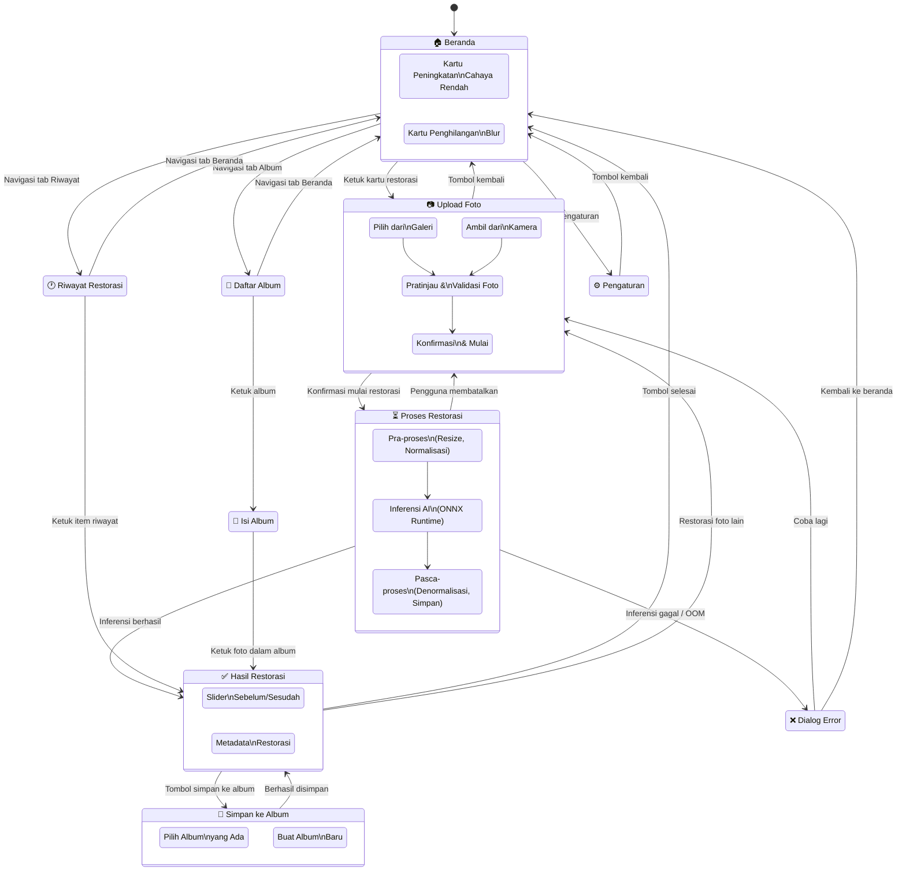
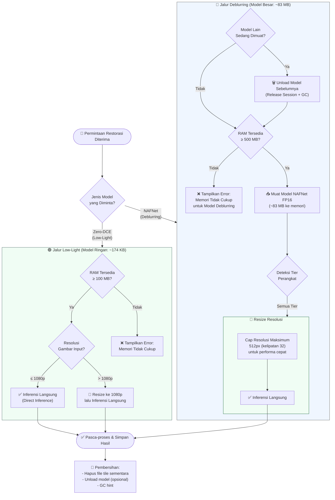
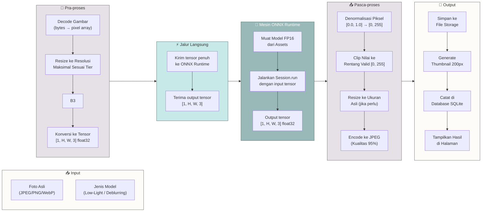

# 🔀 Diagram Alur — Lumina Restore

> Diagram di bawah menggunakan format Mermaid dan dapat di-render langsung di GitHub, VS Code, atau [mermaid.live](https://mermaid.live).

---

## 1. Screen Flow (Alur Navigasi Layar)

---

## 2. Memory Management Flow (Alur Manajemen Memori)

---

## 3. Inference Pipeline (Pipeline Inferensi)

