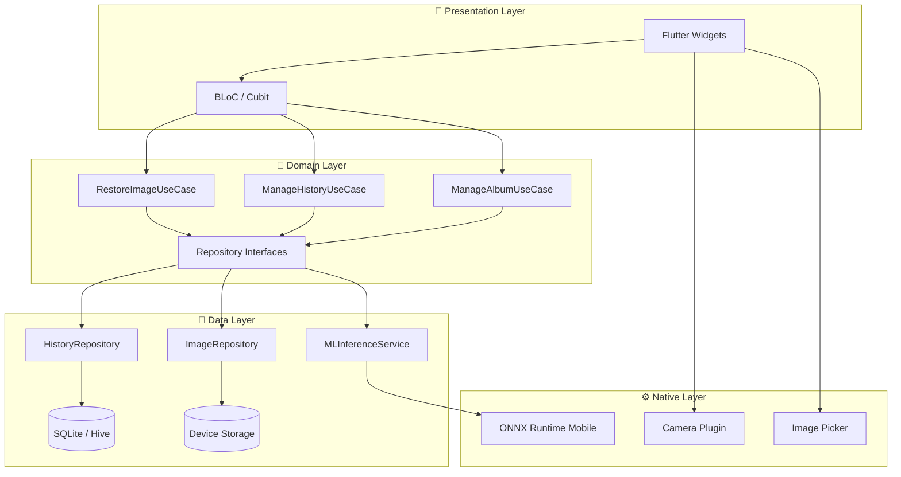
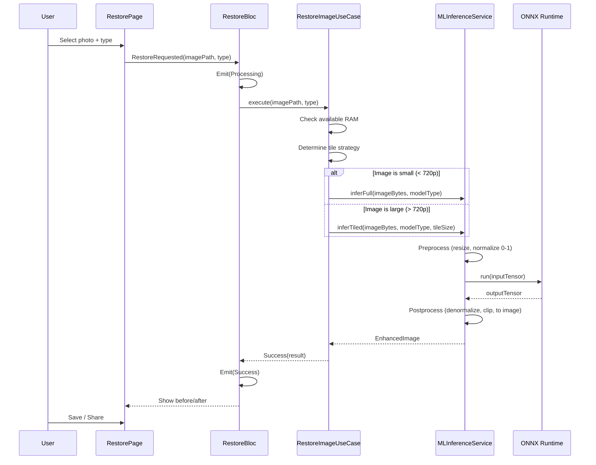
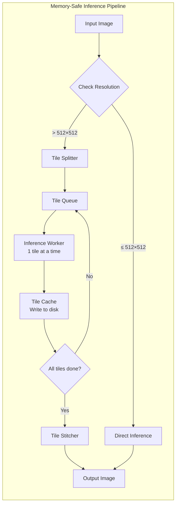
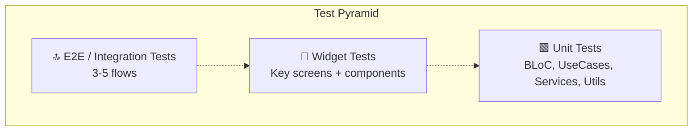
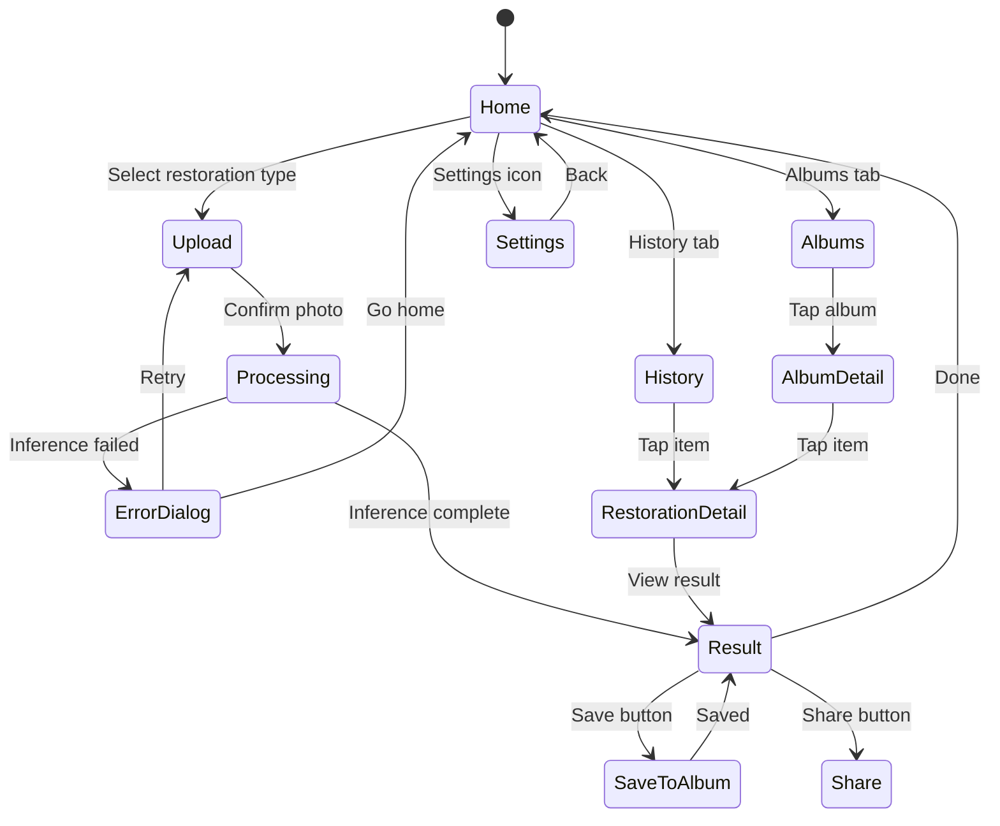
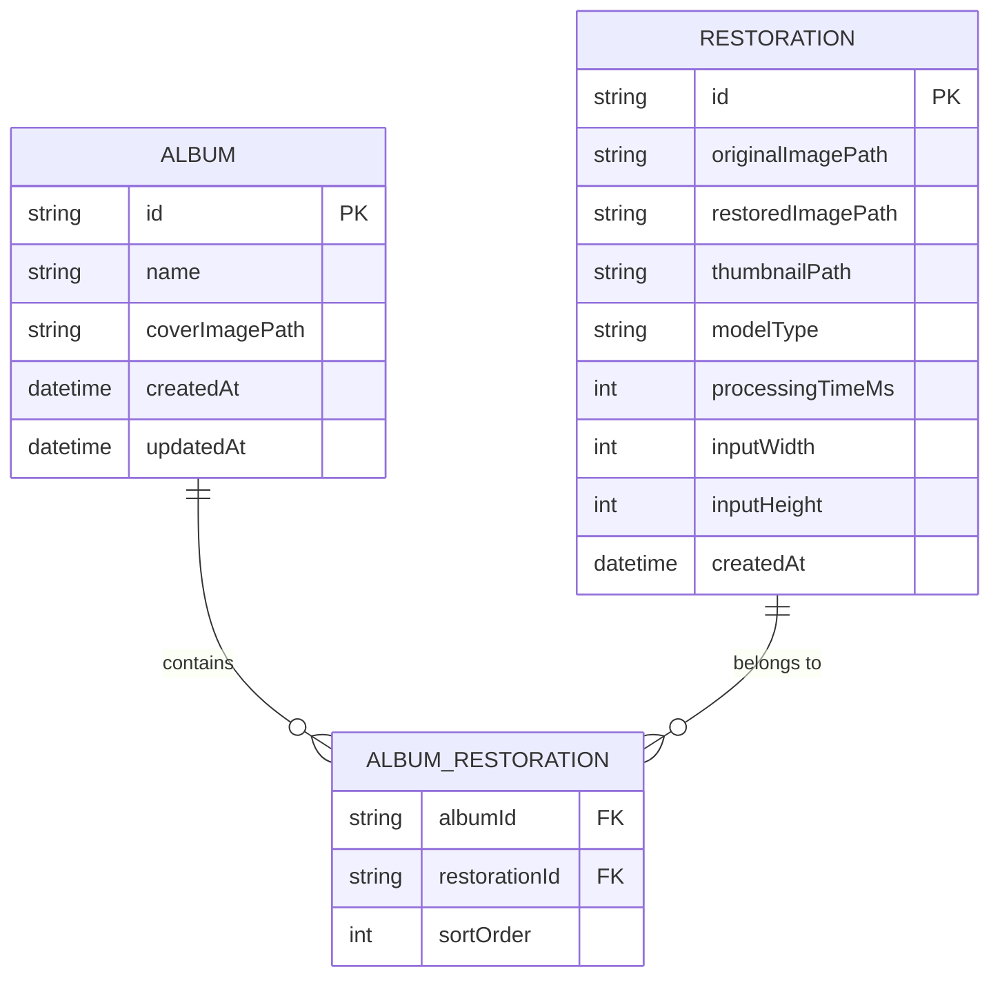
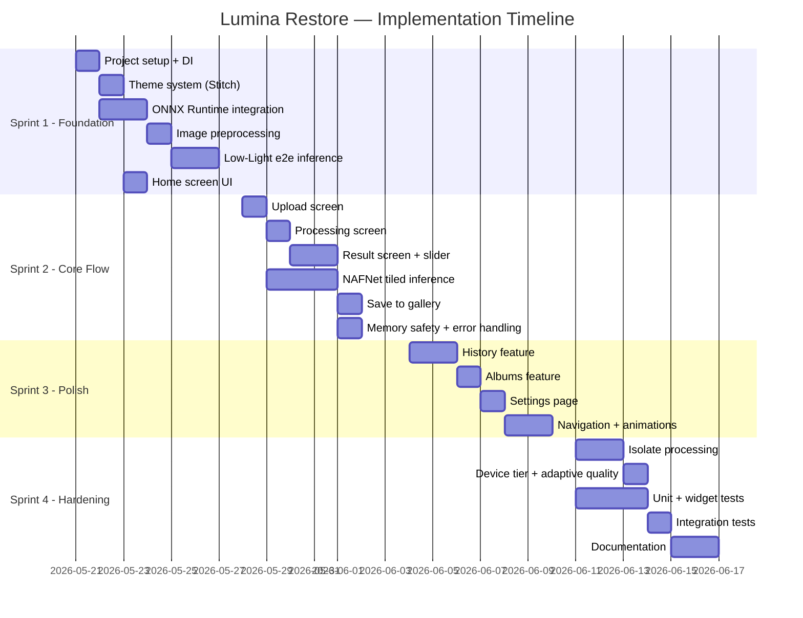

# 🏗️ Implementation Plan — Lumina Restore (AI Photo Restorer)

> **Project:** vision-enchance-ml  
> **Platform:** Flutter (Android-first, iOS later)  
> **Date:** 2026-05-20  
> **Status:** Planning Phase  

---

## 1. Project Overview

### 1.1 What We're Building

A premium mobile app that restores degraded photos using on-device AI inference. Two core capabilities:

| Feature | Model | Format | Size (FP16) | Input | Output |
|---------|-------|--------|-------------|-------|--------|
| **Deblurring** | NAFNet | ONNX FP16 | ~83 MB | Blurry photo | Sharp photo |
| **Low-Light Enhancement** | Zero-DCE | ONNX FP16 | ~174 KB | Dark photo | Bright photo |

### 1.2 Current State Analysis

```
vision-enchance-ml/
├── lib/main.dart              ← Default Flutter counter (untouched)
├── models/
│   ├── deblurring_nafnet_2025may.onnx       (87 MB — FP32)
│   ├── deblurring_nafnet_2025may_fp16.onnx  (79 MB — FP16) ✅ Use this
│   ├── low_light_enhancement.onnx           (320 KB — FP32)
│   ├── low_light_enhancement_fp16.onnx      (170 KB — FP16) ✅ Use this
│   ├── low_light_enhancement_int8.onnx      (105 KB — INT8, backup)
│   ├── convert_model.py
│   └── quantize_models.py
├── pubspec.yaml               ← Bare Flutter skeleton, no deps yet
└── android/                   ← Default Android config
```

> [!IMPORTANT]
> The Flutter app is still the default template. All UI, architecture, and ML integration must be built from scratch.

### 1.3 Stitch Design Reference (Project ID: `16847048663768155713`)

The "AI Photo Restorer" Stitch project has **9 visible screens** designed with the **"Lumina Restore"** brand:

| Screen | Purpose |
|--------|---------|
| **Dashboard - Vertical Types** | Home screen with restoration type cards |
| **Upload Photo** | Photo picker + camera upload |
| **Restoration in Progress** | Processing animation with progress |
| **Restoration Result** | Before/after comparison with slider |
| **Restoration Details** | Detailed metadata and enhancement info |
| **Save to Album Selection** | Album picker for saving results |
| **Albums Overview** | Gallery organized by albums |
| **History Gallery with Filters** | Complete restoration history |
| **Offline App Settings** | App preferences and model management |

**Design System:** Soft Minimalist — Manrope headlines, Inter body, creamy whites (`#FDFCF8`), muted teal accent (`#98B9B7`), generous whitespace, ambient shadows, 8px/16px rounded corners.

---

## 2. System Architecture

### 2.1 High-Level Architecture Diagram



### 2.2 Architecture: Clean Architecture + BLoC

```
lib/
├── main.dart
├── app/
│   ├── app.dart                     # MaterialApp + Router config
│   └── theme/
│       ├── app_theme.dart           # Lumina Restore theme tokens
│       ├── app_colors.dart          # Color palette from Stitch
│       └── app_typography.dart      # Manrope + Inter setup
│
├── core/
│   ├── constants/
│   │   ├── app_constants.dart       # Image max sizes, model paths
│   │   └── model_config.dart        # ONNX model configs per type
│   ├── errors/
│   │   ├── failures.dart            # Domain failures
│   │   └── exceptions.dart          # Data exceptions
│   ├── utils/
│   │   ├── image_utils.dart         # Resize, normalize, denormalize
│   │   ├── memory_utils.dart        # RAM check, buffer pool
│   │   └── file_utils.dart          # Path helpers
│   └── di/
│       └── injection.dart           # get_it / injectable setup
│
├── features/
│   ├── home/
│   │   ├── presentation/
│   │   │   ├── pages/home_page.dart
│   │   │   ├── widgets/
│   │   │   └── bloc/home_bloc.dart
│   │   └── ...
│   │
│   ├── restore/
│   │   ├── domain/
│   │   │   ├── entities/restoration.dart
│   │   │   ├── repositories/restore_repository.dart
│   │   │   └── usecases/restore_image.dart
│   │   ├── data/
│   │   │   ├── repositories/restore_repository_impl.dart
│   │   │   ├── datasources/ml_inference_datasource.dart
│   │   │   └── models/restoration_model.dart
│   │   └── presentation/
│   │       ├── pages/
│   │       │   ├── upload_page.dart
│   │       │   ├── processing_page.dart
│   │       │   └── result_page.dart
│   │       ├── widgets/
│   │       │   ├── before_after_slider.dart
│   │       │   └── progress_indicator.dart
│   │       └── bloc/restore_bloc.dart
│   │
│   ├── history/
│   │   ├── domain/
│   │   ├── data/
│   │   └── presentation/
│   │
│   ├── albums/
│   │   ├── domain/
│   │   ├── data/
│   │   └── presentation/
│   │
│   └── settings/
│       ├── domain/
│       ├── data/
│       └── presentation/
│
└── services/
    ├── ml/
    │   ├── onnx_inference_service.dart    # Core ONNX runtime wrapper
    │   ├── image_preprocessor.dart        # Resize + normalize pipeline
    │   ├── image_postprocessor.dart        # Denormalize + reconstruct
    │   └── model_manager.dart             # Load/unload lifecycle
    └── storage/
        ├── local_database.dart            # SQLite/Hive operations
        └── file_storage_service.dart      # Save/load images from disk
```

### 2.3 Data Flow: Restoration Pipeline



---

## 3. OOM Prevention Strategy

> [!CAUTION]
> The NAFNet deblurring model is **~83 MB FP16**. Running inference on a full-resolution photo (e.g. 4032×3024 from a 12MP camera) will crash most devices. This section is **critical**.

### 3.1 Model-Specific Memory Profiles

| Model | Weight Size | Peak RAM (Full 1080p) | Peak RAM (Tiled 512×512) |
|-------|-------------|----------------------|--------------------------|
| NAFNet Deblurring FP16 | 83 MB | ~1.5 GB ❌ | ~350 MB ✅ |
| Zero-DCE Low-Light FP16 | 174 KB | ~50 MB ✅ | ~15 MB ✅ |

### 3.2 Memory Management Architecture



### 3.3 Concrete Strategies

#### Strategy 1: Input Resolution Cap

```dart
// Max input resolution per model to guarantee no OOM
const kMaxResolution = {
  ModelType.deblurring: Size(1280, 720),   // 720p max for NAFNet
  ModelType.lowLight: Size(1920, 1080),    // 1080p max for Zero-DCE (tiny model)
};
```

#### Strategy 2: Tiled Inference (NAFNet)

```
Original 4032×3024 image
    ↓ Resize to 1280×960 (fit within max)
    ↓ Split into 512×512 tiles with 32px overlap
    ↓ Process each tile sequentially
    ↓ Stitch tiles back (blending overlap regions)
    ↓ Upscale result if needed
```

#### Strategy 3: Lazy Model Loading / Unloading

```dart
class ModelManager {
  OrtSession? _activeSession;
  ModelType? _loadedModel;

  // Only ONE model loaded at a time
  Future<OrtSession> getSession(ModelType type) async {
    if (_loadedModel == type && _activeSession != null) {
      return _activeSession!;
    }
    await _unloadCurrent();
    _activeSession = await _loadModel(type);
    _loadedModel = type;
    return _activeSession!;
  }

  Future<void> _unloadCurrent() async {
    _activeSession?.release();
    _activeSession = null;
    _loadedModel = null;
    // Force GC hint
  }
}
```

#### Strategy 4: Available RAM Check

```dart
Future<bool> hasEnoughMemory(ModelType type) async {
  final availableRAM = await getAvailableRAM();
  final requiredRAM = kMinRAMRequired[type]!; // e.g., 400MB for NAFNet
  return availableRAM > requiredRAM;
}
```

#### Strategy 5: Isolate-Based Processing

```dart
// Heavy inference runs in a separate Dart Isolate
// to avoid blocking the UI thread
Future<Uint8List> processInIsolate(ProcessRequest request) async {
  return await compute(_runInference, request);
}
```

### 3.4 Device Tier Classification

| Tier | RAM | NAFNet Strategy | Low-Light Strategy |
|------|-----|-----------------|-------------------|
| **Low-end** | < 3 GB | Tiles 256px, max 720p input | Direct, max 720p |
| **Mid-range** | 3-6 GB | Tiles 512px, max 1080p input | Direct, max 1080p |
| **High-end** | > 6 GB | Tiles 512px, max 1440p input | Direct, max 1440p |

---

## 4. Key Dependencies

```yaml
dependencies:
  flutter:
    sdk: flutter

  # State Management
  flutter_bloc: ^9.0.0
  equatable: ^2.0.0

  # ML Inference
  onnxruntime: ^latest       # Official ONNX Runtime for Flutter

  # Image Processing
  image: ^4.0.0              # Dart-native image manipulation
  image_picker: ^1.0.0       # Camera + gallery picker

  # Local Storage
  sqflite: ^2.3.0            # SQLite for history metadata
  path_provider: ^2.1.0      # App directories

  # UI Components
  photo_view: ^0.15.0        # Pinch-to-zoom for results
  shimmer: ^3.0.0            # Loading skeletons
  google_fonts: ^6.0.0       # Manrope + Inter

  # DI
  get_it: ^8.0.0
  injectable: ^2.0.0

  # Navigation
  go_router: ^14.0.0

  # Utilities
  share_plus: ^10.0.0        # Share restored images
  permission_handler: ^11.0.0

dev_dependencies:
  flutter_test:
    sdk: flutter
  bloc_test: ^9.0.0
  mocktail: ^1.0.0
  injectable_generator: ^2.0.0
  build_runner: ^2.4.0
```

---

## 5. Phased Implementation Strategy

### Phase 1: MVP Core (Sprint 1-2, ~2 weeks)

> **Goal:** End-to-end restoration flow — pick photo → process → see result.

#### Sprint 1: Foundation (Week 1)

| # | Task | Priority | Est. |
|---|------|----------|------|
| 1 | Project setup: clean pubspec, folder structure, DI | P0 | 4h |
| 2 | Theme system from Stitch (colors, typography, shapes) | P0 | 3h |
| 3 | ONNX Runtime integration + model loading test | P0 | 6h |
| 4 | Image preprocessing pipeline (resize, normalize) | P0 | 4h |
| 5 | Low-Light inference — end to end | P0 | 6h |
| 6 | Basic Home screen (2 restoration type cards) | P0 | 3h |

#### Sprint 2: Core Flow (Week 2)

| # | Task | Priority | Est. |
|---|------|----------|------|
| 7 | Upload/Pick photo screen | P0 | 4h |
| 8 | Processing screen with progress animation | P0 | 4h |
| 9 | Result screen with before/after slider | P0 | 6h |
| 10 | NAFNet deblurring — tiled inference pipeline | P0 | 8h |
| 11 | Save result to device gallery | P0 | 3h |
| 12 | Memory safety: RAM check + resolution cap | P0 | 4h |
| 13 | Error handling: model load fail, OOM, inference error | P0 | 3h |

**MVP Deliverable:** App that can pick a photo, run either low-light or deblurring restoration, show before/after, and save.

---

### Phase 2: Polish & UX (Sprint 3, ~1 week)

| # | Task | Priority | Est. |
|---|------|----------|------|
| 14 | History feature — SQLite storage, list with thumbnails | P1 | 6h |
| 15 | Albums feature — create, list, add restorations | P1 | 4h |
| 16 | Settings page — model management, storage info | P1 | 3h |
| 17 | Navigation setup with go_router | P1 | 3h |
| 18 | Micro-animations: page transitions, progress, cards | P1 | 4h |
| 19 | Empty states, loading skeletons, error screens | P1 | 3h |
| 20 | Share functionality | P1 | 2h |

---

### Phase 3: Refinement & Hardening (Sprint 4, ~1 week)

| # | Task | Priority | Est. |
|---|------|----------|------|
| 21 | Device tier detection + adaptive quality | P2 | 4h |
| 22 | Isolate-based inference (non-blocking UI) | P2 | 6h |
| 23 | Tile stitching with overlap blending | P2 | 4h |
| 24 | Batch processing — multiple photos | P2 | 4h |
| 25 | App icon, splash screen | P2 | 2h |
| 26 | Performance profiling + optimization | P2 | 4h |
| 27 | Edge case handling: corrupt images, unsupported formats | P2 | 3h |

---

### Phase 4: Testing & Documentation (Ongoing)

| # | Task | Priority | Est. |
|---|------|----------|------|
| 28 | Unit tests — BLoC, UseCases, Repositories | P0 | 6h |
| 29 | Widget tests — key screens | P1 | 4h |
| 30 | Integration tests — full restoration flow | P1 | 4h |
| 31 | Performance benchmarks — per model, per device tier | P2 | 3h |
| 32 | Documentation artifacts (see Section 7) | P1 | 4h |

---

## 6. Testing Strategy

### 6.1 Test Pyramid



### 6.2 Unit Tests

| Module | What to Test | Tool |
|--------|-------------|------|
| `RestoreBloc` | State transitions: initial → processing → success/error | `bloc_test` |
| `RestoreImageUseCase` | Resolution capping, tile strategy selection, error propagation | `mocktail` |
| `ImagePreprocessor` | Normalize values 0-1, correct resize dimensions | `flutter_test` |
| `ImagePostprocessor` | Clip to 0-255, correct output dimensions | `flutter_test` |
| `ModelManager` | Single model loaded, unload on switch, error on missing file | `mocktail` |
| `MemoryUtils` | Correct tier classification, RAM threshold | `flutter_test` |
| `TileSplitter` | Correct tile count, overlap regions, edge tiles | `flutter_test` |
| `TileStitcher` | Seamless stitch, no visible seams at overlaps | `flutter_test` |

### 6.3 Widget Tests

| Screen | What to Test |
|--------|-------------|
| `HomePage` | Renders 2 restoration cards, navigation on tap |
| `UploadPage` | Camera/gallery buttons, selected image preview |
| `ProcessingPage` | Progress animation displays, cancel button works |
| `ResultPage` | Before/after slider interaction, save/share buttons |
| `BeforeAfterSlider` | Drag gesture, correct image clipping |

### 6.4 Integration Tests

| Flow | Steps |
|------|-------|
| **Low-Light Restoration** | Pick dark image → select Low-Light → process → verify result → save |
| **Deblurring Restoration** | Pick blurry image → select Deblurring → process → verify result → save |
| **History Flow** | Complete restoration → verify history entry → open from history |
| **Error Recovery** | Pick corrupt image → verify error dialog → return to home |

### 6.5 Performance Benchmarks

| Metric | Target | How to Measure |
|--------|--------|----------------|
| Low-Light inference (720p) | < 2 seconds | `Stopwatch` in service layer |
| NAFNet inference (720p, tiled) | < 8 seconds | `Stopwatch` in service layer |
| Model load time | < 3 seconds | Cold start measurement |
| Peak RAM during NAFNet | < 500 MB | Android Profiler / `dart:developer` |
| App cold start | < 3 seconds | `flutter run --profile` |

---

## 7. Required Documentation Artifacts

### 7.1 Diagrams

| # | Diagram | Type | Purpose | Tool |
|---|---------|------|---------|------|
| 1 | **System Architecture** | Component Diagram | Show layers, dependencies, data flow | Mermaid |
| 2 | **Restoration Pipeline** | Sequence Diagram | User → UI → BLoC → ML → ONNX → Result | Mermaid |
| 3 | **Tiled Inference Pipeline** | Flowchart | Tile split → process → stitch logic | Mermaid |
| 4 | **Navigation/Screen Flow** | State Machine | All screens + transitions + deeplinks | Mermaid |
| 5 | **Data Model ER Diagram** | ER Diagram | Restoration, Album, History entities | Mermaid |
| 6 | **Memory Management Flow** | Flowchart | RAM check → tier → strategy decision tree | Mermaid |
| 7 | **Model Lifecycle** | State Diagram | Unloaded → Loading → Ready → Inference → Unloaded | Mermaid |

### 7.2 Technical Documents

| # | Document | Purpose |
|---|----------|---------|
| 1 | **DESIGN.md** | Design system tokens, component specs (from Stitch) |
| 2 | **ARCHITECTURE.md** | Clean Architecture layers, DI setup, coding conventions |
| 3 | **ML_INTEGRATION.md** | ONNX Runtime setup, model specs, I/O formats, preprocessing steps |
| 4 | **OOM_STRATEGY.md** | Device tiers, tiling algorithm, memory thresholds |
| 5 | **API_CONTRACT.md** | Internal service interfaces (MLService, Repository, etc.) |
| 6 | **TESTING.md** | Test plan, coverage targets, CI integration |
| 7 | **README.md** | Project overview, setup instructions, build commands |

### 7.3 Screen Flow Map



### 7.4 Data Model



---

## 8. Risk Register

| # | Risk | Impact | Likelihood | Mitigation |
|---|------|--------|------------|------------|
| 1 | NAFNet causes OOM on low-end devices | High | High | Tiled inference, resolution cap, RAM check |
| 2 | ONNX Runtime Flutter plugin unstable | High | Medium | Evaluate `ort_flutter`, fallback to platform channels |
| 3 | Slow inference frustrates users | Medium | Medium | Progress animation, background isolate, cancel button |
| 4 | NAFNet deblurring quality poor on mobile FP16 | Medium | Low | Visual comparison tests, fallback to INT8 for speed |
| 5 | Large APK size (83MB model bundled) | Medium | High | On-demand model download, asset delivery API |
| 6 | Flutter image/path provider version conflicts | Low | Medium | Pin dependency versions, regular `pub upgrade` |

---

## 9. Sprint Backlog Summary



---

## 10. Definition of Done

### MVP (End of Sprint 2)

- [ ] User can pick a photo from gallery/camera
- [ ] User can choose between Low-Light or Deblurring
- [ ] App performs on-device ONNX inference without crashing
- [ ] Before/after comparison slider works
- [ ] User can save restored photo to device
- [ ] App gracefully handles OOM (shows error, doesn't crash)
- [ ] Works on Android 8+ (API 26+)

### v1.0 (End of Sprint 4)

- [ ] All MVP criteria met
- [ ] History tracking with thumbnails
- [ ] Album organization
- [ ] Settings with storage management
- [ ] Micro-animations and premium UI polish
- [ ] 80%+ unit test coverage on BLoC + UseCases
- [ ] Widget tests for all key screens
- [ ] 3 integration test flows pass
- [ ] Documentation artifacts complete
- [ ] Performance benchmarks meet targets
